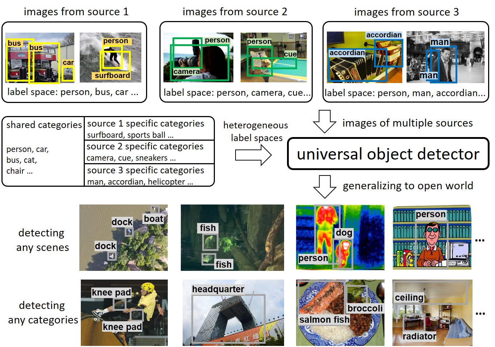

# UniDetector

  

> [**Detecting Everything in the Open World: Towards Universal Object Detection**](https://arxiv.org/abs/2303.11749),        
> *CVPR 2023

## Installation

Our code is based on [mmdetection v2.18.0](https://github.com/open-mmlab/mmdetection/tree/v2.18.0). See its [official installation](https://github.com/open-mmlab/mmdetection/blob/v2.18.0/docs/get_started.md) for installation.

[CLIP](https://github.com/openai/CLIP) is also required for running the code.

## Preparation

Please first [prepare datasets](docs/datasets.md)

Prepare the language CLIP embeddings. We have released the pre-computed embeddings in the [clip_embeddings](clip_embeddings/) folder, you can also run the script to obtain the language embeddings:
~~~
python scripts/dump_clip_features_manyprompt.py --ann path_to_annotation_for_datasets --clip_model RN50 --out_path path_to_lanugage_embeddings
~~~

Prepare the pre-trained [RegionCLIP](https://github.com/microsoft/RegionCLIP) parameters. We have released the RegionCLIP embeddings converted in mmdetection formats [here]. The code for parameter conversion will be released soon.

## Singe-dataset training

### End-to-end training

run
~~~
bash tools/dist_train.sh configs/singledataset/clip_end2end_faster_rcnn_r50_c4_1x_coco.py 8 --cfg-options load_from=regionclip_pretrained-cc_rn50_mmdet.pth
~~~
to train a Faster RCNN model on the single COCO dataset (val35k).

### Decoupled training

train the region proposal stage (our CLN model) on the single COCO dataset (val35k):
~~~
bash tools/dist_train.sh configs/singledataset/clip_decouple_faster_rcnn_r50_c4_1x_coco_1ststage.py 8
~~~

extract pre-computed region proposals:
~~~
bash tools/dist_test.sh configs/singledataset/clip_decouple_faster_rcnn_r50_c4_1x_coco_1ststage.py [path_for_trained_checkpoints] 8 --out rp_train.pkl
~~~
Modify the datasets in config files to extract region proposals on the COCO validation datasets. The default proposal names we use are rp_train.pkl and rp_val.pkl, which is specified in the config file of the second stage.

train the RoI classification stage on the single COCO dataset (val35k):
~~~
bash tools/dist_train.sh configs/singledataset/clip_decouple_faster_rcnn_r50_c4_1x_coco_2ndstage.py 8 --cfg-options load_from=regionclip_pretrained-cc_rn50_mmdet.pth
~~~

## Open-world inference

### End-to-end inference

inference on the LVIS v0.5 dataset to evaluation the open-world performance of end-to-end models:
~~~
bash tools/dist_test.sh configs/inference/clip_end2end_faster_rcnn_r50_c4_1x_lvis_v0.5.py [path_for_trained_checkpoints] 8 --eval bbox
~~~

### Decoupled inference

extract pre-computed region proposals:
~~~
bash tools/dist_test.sh configs/inference/clip_decouple_faster_rcnn_r50_c4_1x_lvis_v0.5_1ststage.py [path_for_trained_checkpoints] 8 --out rp_val_ow.pkl
~~~

inference with pre-computed proposals and the RoI classification stage:
~~~
bash tools/dist_test.sh configs/inference/clip_decouple_faster_rcnn_r50_c4_1x_lvis_v0.5_2ndstage.py [path_for_trained_checkpoints] 8 --eval bbox
~~~

### Inference with probability calibration

The code for probability calibration will be released soon.

## Multi-dataset training

The steps for multi-dataset training are generally the same as single-dataset training. Use the config files under `configs/multidataset/` for multi-dataset training. We release the config files for training with two datasets (Objects365 and COCO) and three datasets (OpenImages, Objects365 and COCO). 
